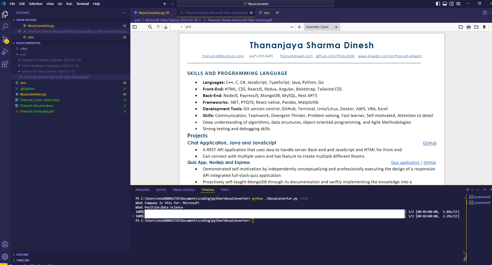

# ResuConvertor

This is a Python script that is used to convert a Resume's and cover letters in Docx format to a PDF format. It uses the `docx2pdf` library to convert the resumes.

## Features
- Converts a resume in Docx format to a PDF format.
- Converts a cover letter in Docx format to a PDF format.
- Converts both Resume and Cover letter in Docx format to a PDF format.
- Converts both Resume and Cover letter in Docx format to a PDF format and merges them into a single PDF file.
- Coverts both Resume and Cover letter in Docx format to a PDF format and merges them with a transcript into a single PDF file.

## Installation
1. clone the repository
```bash
https://github.com/Thanush38/ResuConvertor.git
```
2. Install the required libraries
```bash
pip install -r requirements.txt
```

3. Add resume, cover letter in docx format and transcript in pdf format to source folder.
4. change .env file with names of the files.
5. Run the script
```bash
python ResuConvertor.py <option>
```

## Options
- '-r' : Converts a resume in Docx format to a PDF format.
- '-c' : Converts a cover letter in Docx format to a PDF format.
- '-rc' : Converts both Resume and Cover letter in Docx format to a PDF format.
- '-rcc' : Converts both Resume and Cover letter in Docx format to a PDF format and merges them into a single PDF file.
- '-rctc' : Converts both Resume and Cover letter in Docx format to a PDF format and merges them with a transcript into a single PDF file.

## Examples
To view a video of this script in action, click [here](https://drive.google.com/file/d/17k4S6s2DTuZXwiXtK6dUnpaQroIrTg6S/view?usp=drive_link).



## Contributing

Contributions are welcome! Please fork the repository and submit a pull request.

1. Fork the repository.
2. Create your feature branch (`git checkout -b feature/AmazingFeature`).
3. Commit your changes (`git commit -m 'Add some AmazingFeature'`).
4. Push to the branch (`git push origin feature/AmazingFeature`).
5. Open a pull request.


## License
This project is licensed under the MIT License - see the [LICENSE](LICENSE.md) file for details.